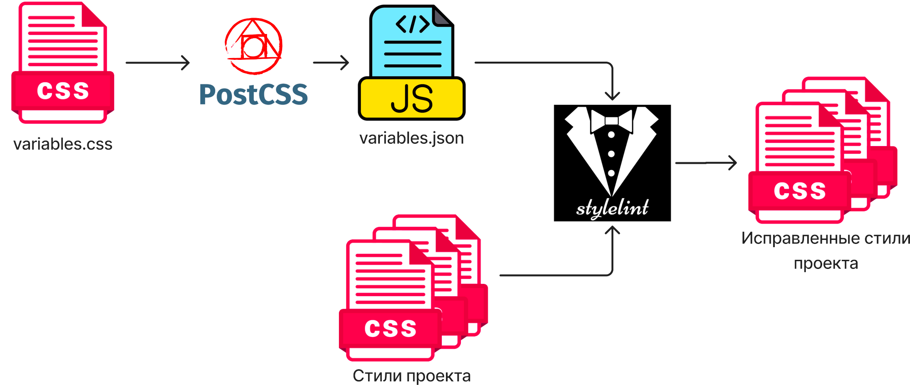
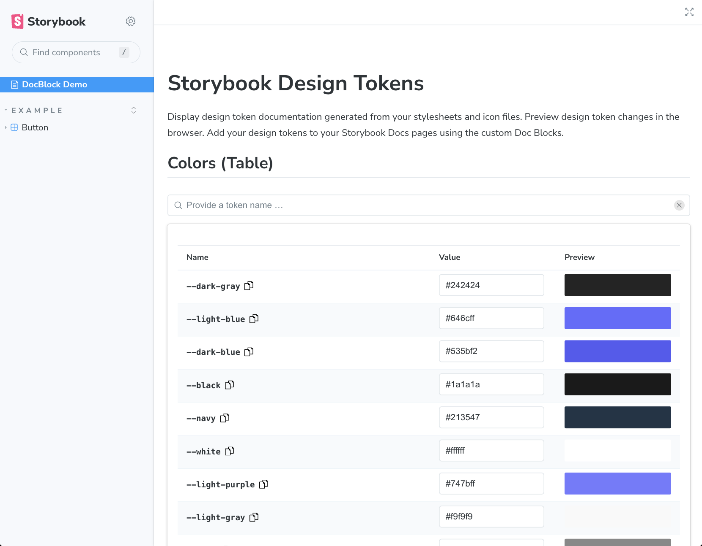

# Демо проект по работе с дизайн-токенами

В проекте рассматриваются:
- [Автоматизация использования дизайн-токенов вместо жёстко заданных переменных с помощью Stylelint + PostCSS](https://habr.com/ru/articles/779492/)

- Генерация документации для дизайн-токенов из css-переменных в Storybook
  

